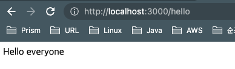

# 0 INTRODUCTION
  
# 0.0 ❤️ 무료 강의 ❤️
  
# 0.1 Welcome (03:48)
  
# 0.2 Requirements (03:15)

insomnia 설치

https://insomnia.rest/download

  
# 0.3 Project Setup (02:58)

git 연동 : https://github.com/sunjolee/hi-nest.git

npm i -g @nestjs/cli

nest new hi-nest


# 1 ARCHITECTURE OF NESTJS
  
# 1.0 Overview (04:57)

npm run start:dev

http://localhost:3000/ 실행

---

* 순서

    1. main.ts
    
    2. app.module.ts
    
    3. app.controller.ts
    
    4. app.service.ts ---> Hello World! 출력

  
# 1.1 Controllers (04:47)

* 컨트롤러가 하는 일은 기본적으로 url을 가져오고 함수를 실행하는 거야

  express의 router와 같은 존재


```typescript
import { Controller, Get } from '@nestjs/common';
import { AppService } from './app.service';

@Controller()
export class AppController {
  constructor(private readonly appService: AppService) {}

  @Get()
  getHello(): string {
    return this.appService.getHello();
  }

  @Get('/hello')
  sayHello(): string {
    return 'Hello everyone';
  }
}
```


  
# 1.2 Services (03:41)

서비스는 비지니스 로직이 있는 부분

```typescript
import { Injectable } from '@nestjs/common';

@Injectable()
export class AppService {
  getHello(): string {
    return 'Hello World!';
  }
}

```


# 2 REST API
  
# 2.0 Movies Controller (09:37)

nest g co : 명령하면 movies 컨트롤러가 생성 된다.

CRUD 컨트롤러 작성 & Insomnia 로 테스트
  
# 2.1 More Routes (06:58)
 
... 문법

...prevState를 사용하여 기존 객체를 복사함과 동시에 age키에 새로운 값(23)을 할
당할 수 있습니다.

리액트의 props나 state처럼 이전 정보를 이용하는 경우 유용하게 사용할 수 있습니다.
```typescript
var prevState = {
  name: "yuddomack",
  birth: "1996-11-01",
  age: 22
};

var state = {
  ...prevState,
  age: 23
};

console.log(state); // { name: 'yuddomack', birth: '1996-11-01', age: 23 }
```

```typescript
console.log(updateData);
// { name: 'sunjo', addr: 'sadang' }

const aa = {...updateData, name:'123', col:123};
console.log(aa);
// { name: '123', addr: 'sadang', col: 123 }

```
  
# 2.2 Movies Service part One (10:48)

nest g s : 명령어로 서비스를 만든다.

이 때 app.module.ts 에는 자동으로 코드가 생성 된다.

entity 와 service & controller 연동

  
# 2.3 Movies Service part Two (08:03)

 
# 2.4 DTOs and Validation part One (10:52)

* 유효성 검사를 위해 설치

npm i class-validator class-transformer
  
# 2.5 DTOs and Validation part Two (05:34)
  
# 2.6 Modules and Dependency Injection (07:07)
  
# 2.7 Express on NestJS (03:22)


# 3 UNIT TESTING
  
# 3.0 Introduction to Testing in Nest (04:54)
  
# 3.1 Your first Unit Test (04:12)
  
# 3.2 Testing getAll and getOne (08:16)
  
# 3.3 Testing delete and create (07:10)
  
# 3.4 Testing update (05:02)


# 4 E2E TESTING
  
# 4.0 Testing movies (08:31)
  
# 4.1 Testing GET movies id (08:54)
  
# 4.2 Testing PATCH and DELETE movies id (04:09)
  
# 4.3 Finishing Up (01:44)